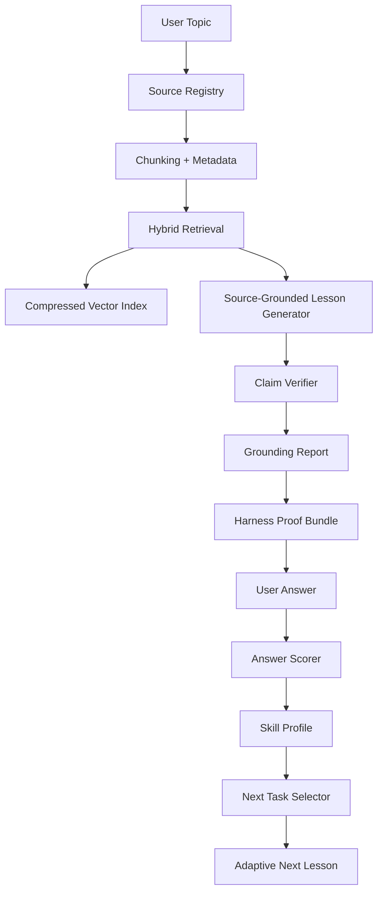
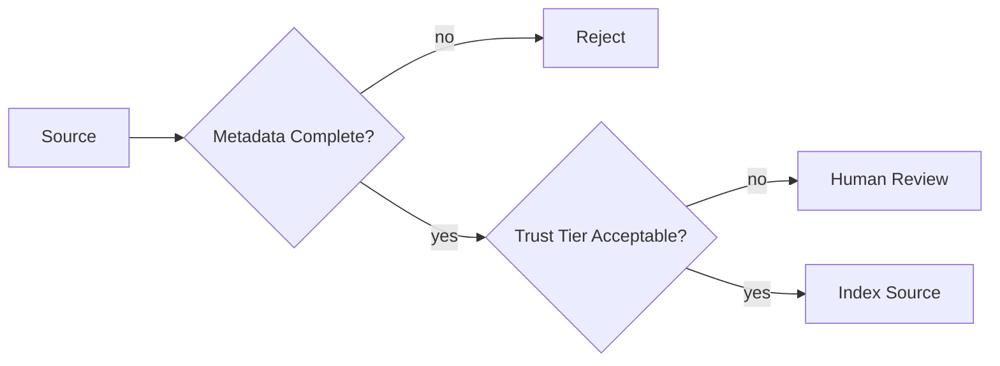
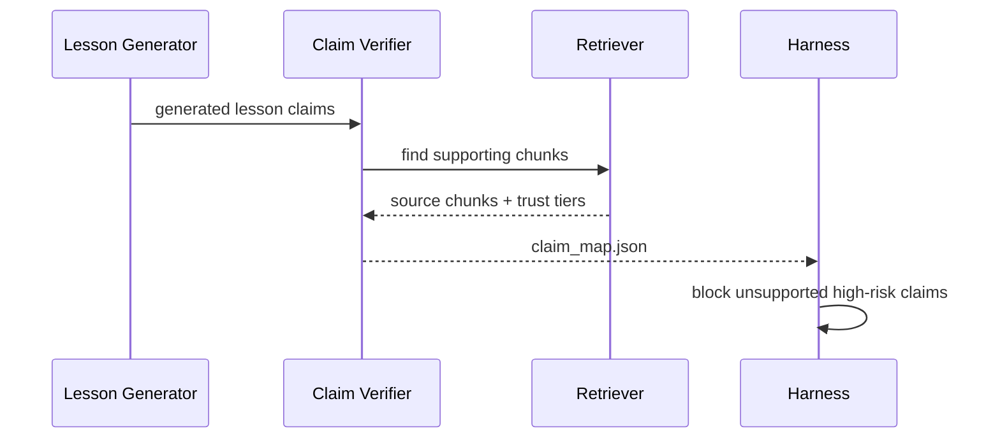

# Architecture Diagrams

## End-to-end flow

```mermaid
flowchart TD
    A[User Topic] --> B[Source Registry]
    B --> C[Chunking + Metadata]
    C --> D[Hybrid Retrieval]
    D --> E[Compressed Vector Index]
    D --> F[Source-Grounded Lesson Generator]
    F --> G[Claim Verifier]
    G --> H[Grounding Report]
    H --> I[Harness Proof Bundle]
    I --> J[User Answer]
    J --> K[Answer Scorer]
    K --> L[Skill Profile]
    L --> M[Next Task Selector]
    M --> N[Adaptive Next Lesson]
```

## Trust gate

```mermaid
flowchart LR
    S[Source] --> M{Metadata Complete?}
    M -- no --> R[Reject]
    M -- yes --> T{Trust Tier Acceptable?}
    T -- no --> H[Human Review]
    T -- yes --> I[Index Source]
```

## Claim verification

```mermaid
sequenceDiagram
    participant G as Lesson Generator
    participant V as Claim Verifier
    participant R as Retriever
    participant H as Harness

    G->>V: generated lesson claims
    V->>R: find supporting chunks
    R-->>V: source chunks + trust tiers
    V-->>H: claim_map.json
    H->>H: block unsupported high-risk claims
```
