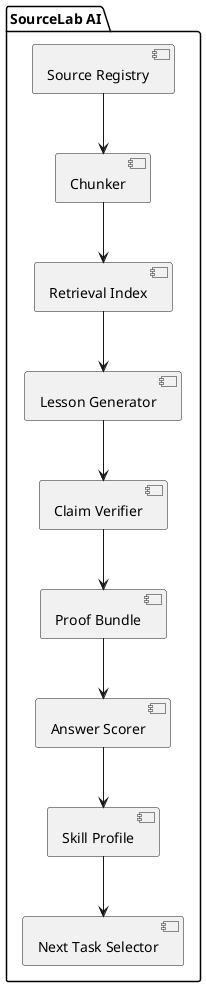
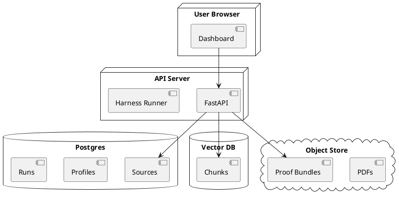

# PlantUML Diagrams

## Component diagram

```plantuml
@startuml
package "SourceLab AI" {
  [Source Registry] --> [Chunker]
  [Chunker] --> [Retrieval Index]
  [Retrieval Index] --> [Lesson Generator]
  [Lesson Generator] --> [Claim Verifier]
  [Claim Verifier] --> [Proof Bundle]
  [Proof Bundle] --> [Answer Scorer]
  [Answer Scorer] --> [Skill Profile]
  [Skill Profile] --> [Next Task Selector]
}
@enduml
```

## Deployment diagram

```plantuml
@startuml
node "User Browser" {
  [Dashboard]
}
node "API Server" {
  [FastAPI]
  [Harness Runner]
}
database "Postgres" {
  [Sources]
  [Profiles]
  [Runs]
}
database "Vector DB" {
  [Chunks]
}
cloud "Object Store" {
  [PDFs]
  [Proof Bundles]
}
[Dashboard] --> [FastAPI]
[FastAPI] --> [Sources]
[FastAPI] --> [Chunks]
[FastAPI] --> [Proof Bundles]
@enduml
```
